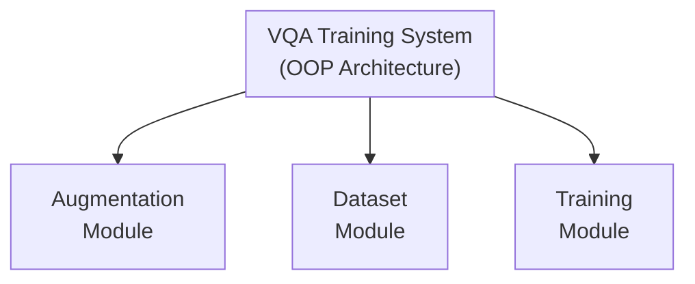
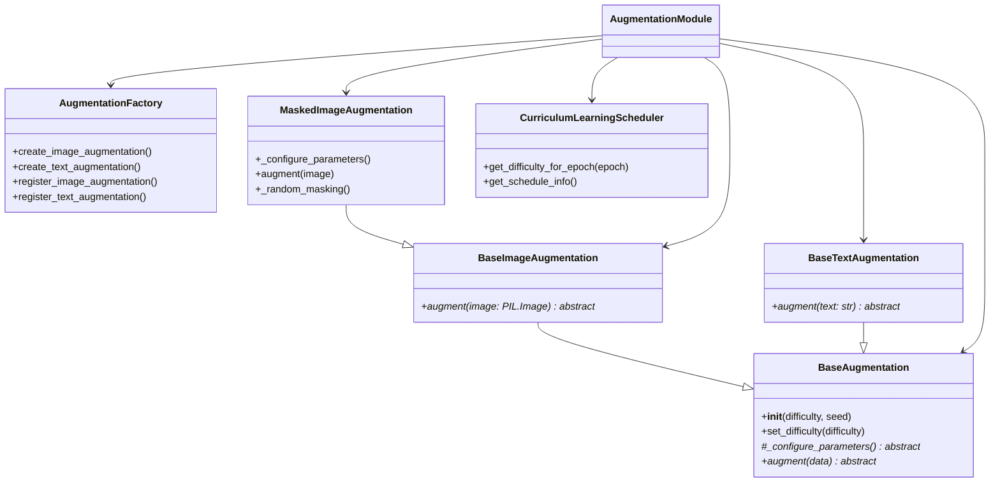
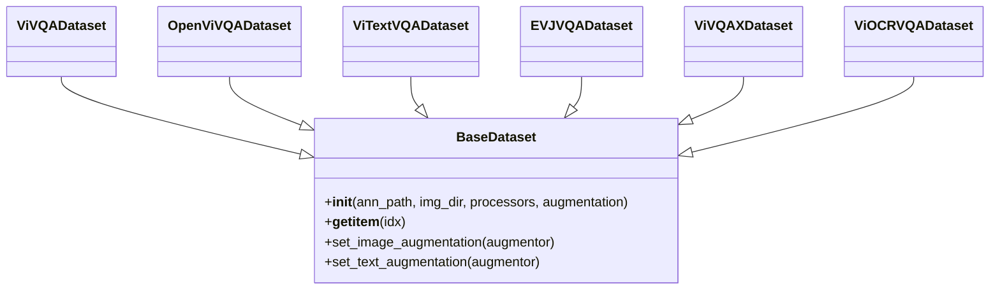
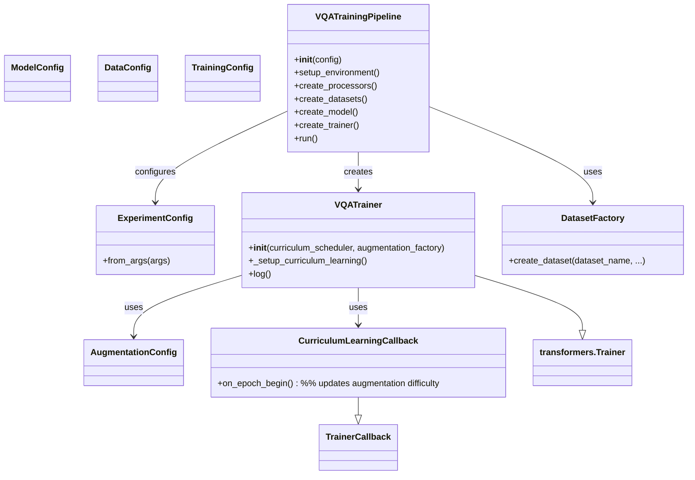
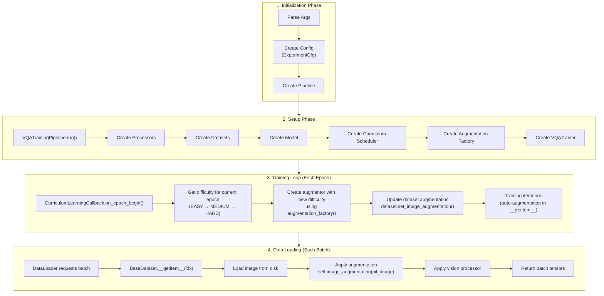
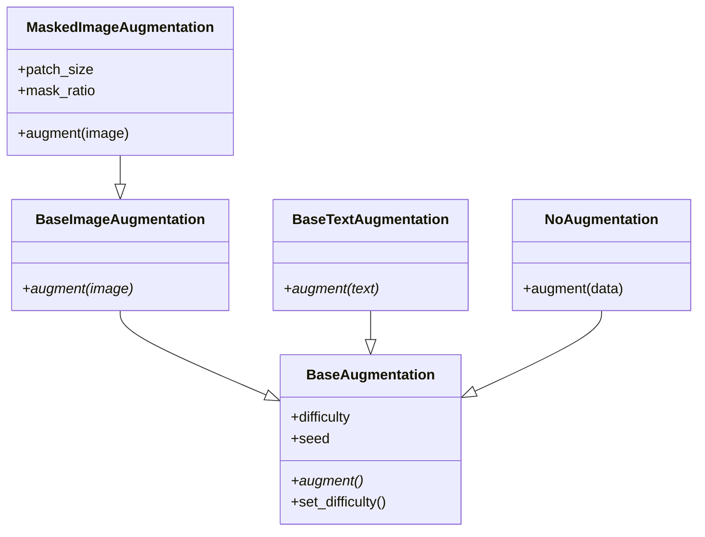
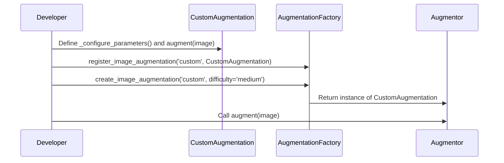

# OOP Architecture Diagram

## System Overview



## Augmentation Module



## Dataset Module



## Training Module



## Data Flow During Training



## Curriculum Learning Timeline

```plaintext
Epochs:  0────────9────────18───────30
         │        │         │        │
Level:   EASY     MEDIUM    HARD     │
         │        │         │        │
         ▼        ▼         ▼        ▼
Mask:   15%      50%       75%
Blur:   Low      Med       High
Jitter: Min      Mod       Max
```

## Design Patterns Used

```plaintext
┌──────────────────────────────────────────────────┐
│ Factory Pattern                                  │
│ ------------------------------------------------ │
│ AugmentationFactory.create_image_augmentation()  │
│ DatasetFactory.create_dataset()                  │
│                                                  │
│ Benefits:                                        │
│ • Centralized object creation                    │
│ • Easy to register new types                     │
│ • Consistent interface                           │
└──────────────────────────────────────────────────┘

┌──────────────────────────────────────────────────┐
│ Strategy Pattern                                 │
│ ------------------------------------------------ │
│ Different augmentation strategies:               │
│ • MaskedImageAugmentation                        │
│ • CustomBlurAugmentation                         │
│ • NoAugmentation                                 │
│                                                  │
│ Benefits:                                        │
│ • Interchangeable at runtime                     │
│ • Easy to add new strategies                     │
│ • Follows Open/Closed Principle                  │
└──────────────────────────────────────────────────┘

┌──────────────────────────────────────────────────┐
│ Template Method Pattern                          │
│ ------------------------------------------------ │
│ BaseAugmentation defines template:               │
│ 1. __init__() calls _configure_parameters()      │
│ 2. Subclasses implement specifics                │
│                                                  │
│ Benefits:                                        │
│ • Consistent initialization                      │
│ • Reusable base logic                            │
│ • Clear extension points                         │
└──────────────────────────────────────────────────┘

┌──────────────────────────────────────────────────┐
│ Observer Pattern                                 │
│ ------------------------------------------------ │
│ CurriculumLearningCallback observes:             │
│ • Training epoch changes                         │
│ • Updates augmentation accordingly               │
│                                                  │
│ Benefits:                                        │
│ • Loose coupling                                 │
│ • Automatic updates                              │
│ • Easy to extend                                 │
└──────────────────────────────────────────────────┘
```

## Class Relationships



## Extension Example



## Summary

The OOP architecture provides:

✅ **Modularity** - Independent, reusable components
✅ **Extensibility** - Easy to add new features
✅ **Maintainability** - Clear structure and responsibilities
✅ **Type Safety** - Strong typing with dataclasses
✅ **Testability** - Each component can be tested independently
✅ **Scalability** - Ready for complex experiments
